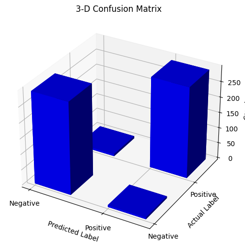

# Brain Tumor Detection System

This project aims to detect brain tumors using Convolutional Neural Networks (CNN). The model is trained on a dataset of brain MRI images, consisting of both tumor and non-tumor cases, to predict whether a tumor is present or not with an accuracy of approximately 98%.

## Dataset

The dataset comprises brain MRI images collected from various sources, containing both tumor and non-tumor cases. Each image is labeled as either 'Tumor' or 'Non-Tumor' class, indicating the presence or absence of a brain tumor.

## Technologies Used

- TensorFlow
- Keras
- Scikit-Learn
- Matplotlib
- Pandas

## Model Architecture

The Convolutional Neural Network (CNN) architecture used for this project consists of multiple convolutional layers followed by max-pooling layers for feature extraction. The extracted features are then flattened and passed through fully connected layers for classification using Support Vector Machine (SVM). The model is trained on the dataset with appropriate preprocessing techniques to enhance its performance.

## Acknowledgments

Special thanks to the creators of the Br35H :: Brain Tumor Detection 2020 dataset for providing the data used in this project. [Dataset Link](https://www.kaggle.com/datasets/ahmedhamada0/brain-tumor-detection/data)

## Performance Report

  <table>
    <tr>
      <td>
        
      </td>
      <td>
        <b>Classification Metrics</b>
          
        <table>
          <tr>
            <th>Class</th>
            <th>Precision</th>
            <th>Recall</th>
            <th>F1-Score</th>
            <th>Support</th>
          </tr>
          <tr>
            <td>0</td>
            <td>0.96</td>
            <td>0.98</td>
            <td>0.97</td>
            <td>299</td>
          </tr>
          <tr>
            <td>1</td>
            <td>0.98</td>
            <td>0.96</td>
            <td>0.97</td>
            <td>301</td>
          </tr>
        </table>
      </td>
    </tr>
  </table>

